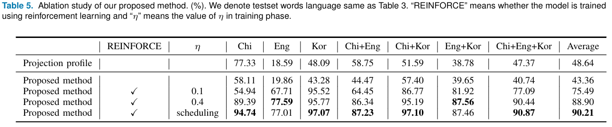

# Multi-Lingual Optical Character Recognition System using the Reinforcement Learning of Character Segmenter
This is a Tensorflow implementation of "Multi-Lingual Optical Character Recognition System using the Reinforcement Learning of Character Segmenter" accepted in IEEE ACCESS 2020, written by Jaewoo Park, Eunji Lee, Yoonsik Kim, Isaac Kang, Hyung Il Koo and Nam Ik Cho.

## Abstract
In this paper, we present a new multi-lingual Optical Character Recognition (OCR) system for scanned documents. In the case of Latin characters, current open source systems such as Tesseract provide very high accuracy. However, the accuracy of the multi-lingual documents, including Asian characters, is usually lower than that for Latin-only documents. For example, when the document is the mix of English, Chinese and/or Korean characters, the OCR accuracy is lowered than English-only because the character/text properties of Chinese and Korean are quite different from Latin-type characters.
To tackle these problems, we propose a new framework using three neural blocks (a segmenter, a switcher, and multiple recognizers)  and the reinforcement learning of the segmenter: The segmenter partitions a given word image into multiple character images, the switcher assigns a recognizer for each sub-image, and the recognizers perform the recognition of assigned sub-images. The training of recognizers and switcher can be considered traditional image classification tasks and we train them with a supervised learning method. However, the supervised learning of the segmenter has two critical drawbacks: Its objective function is sub-optimal and its training requires a large amount of annotation efforts. Thus, by adopting the REINFORCE algorithm, we train the segmenter so as to optimize the overall performance, i.e., we minimize the edit distance of final recognition results. Experimental results have shown that the proposed method significantly improves the performance for multi-lingual scripts and large character set languages without using character boundary labels.

The overall process of Reinforcing character segmenter.

## Installation
```
$ git clone https://github.com/parkjaewoo0611/ReinforceOCR.git
$ cd ReinforceOCR
$ conda env create -f environment.yml --name MultiOCR
$ conda activate MultiOCR
```

## Prepare Dataset
- You can Download our training word dataset [here](http://zeldahagoshipda.com)
- To train model, copy downloaded word dataset to [train/train]
- Examples of our word dataset:


## Train
- Training segmenter in two step
```
$ cd train
$ python train_Proj.py
$ python train_RL.py
```

## Test 
- Test the model with uploaded testset.
```
$ cd test
$ python test.py
```

## Results
Examples of recognition results of our method:


Quantitative Results:



